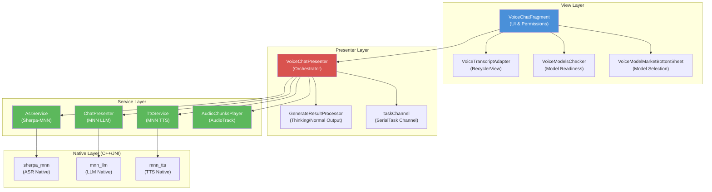
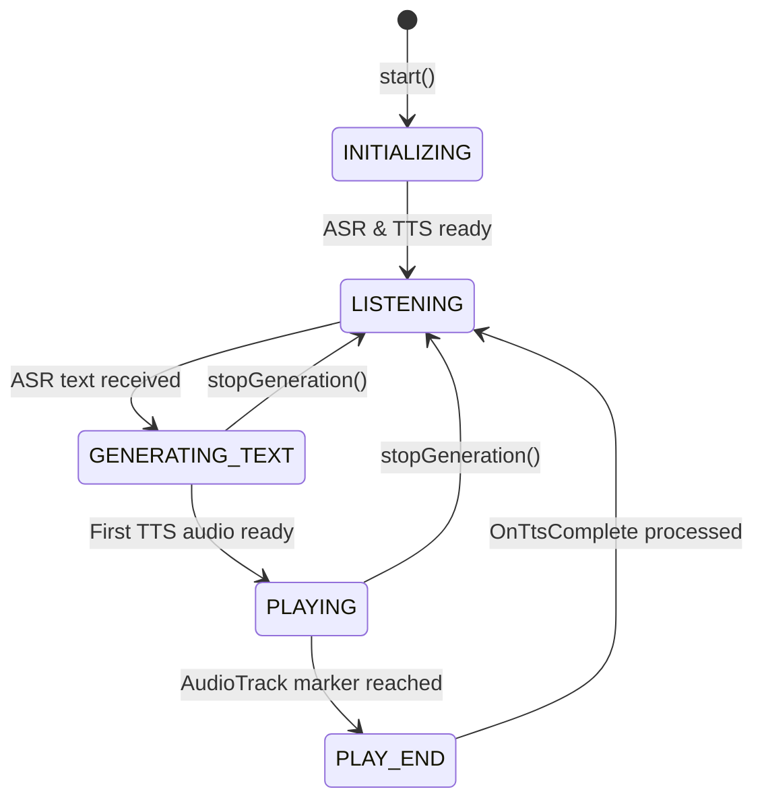
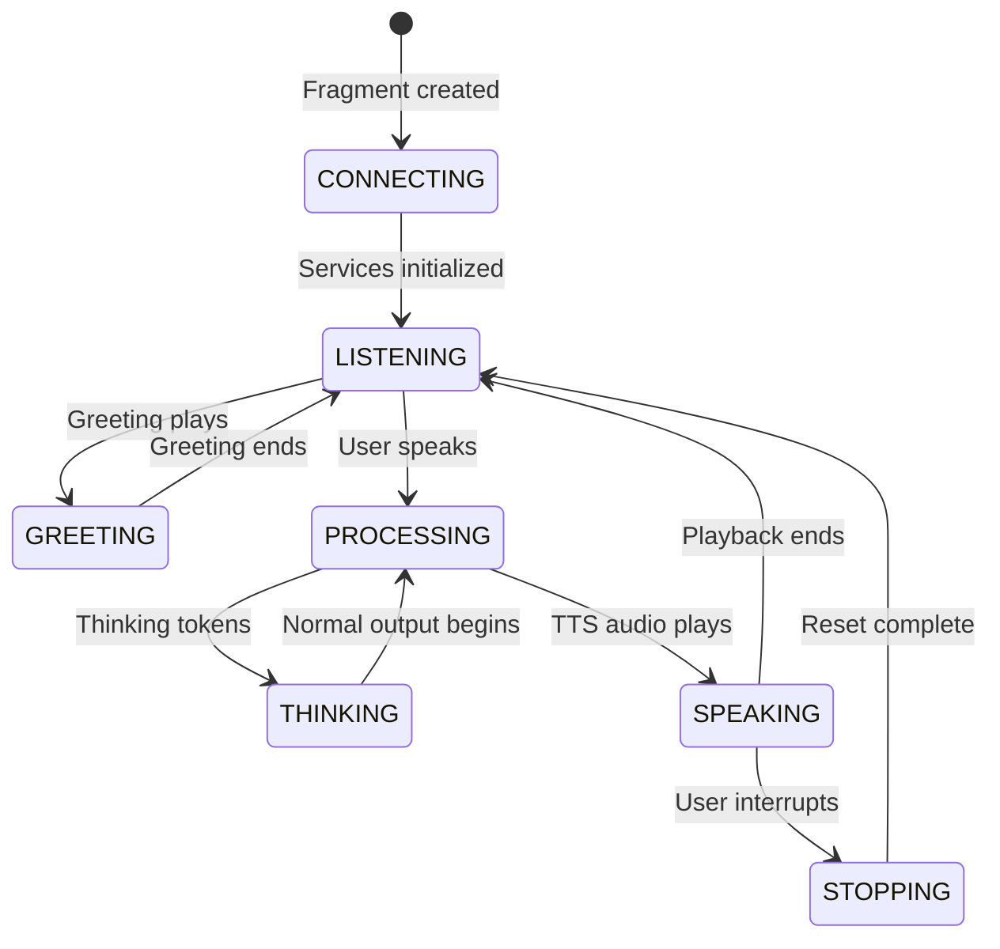
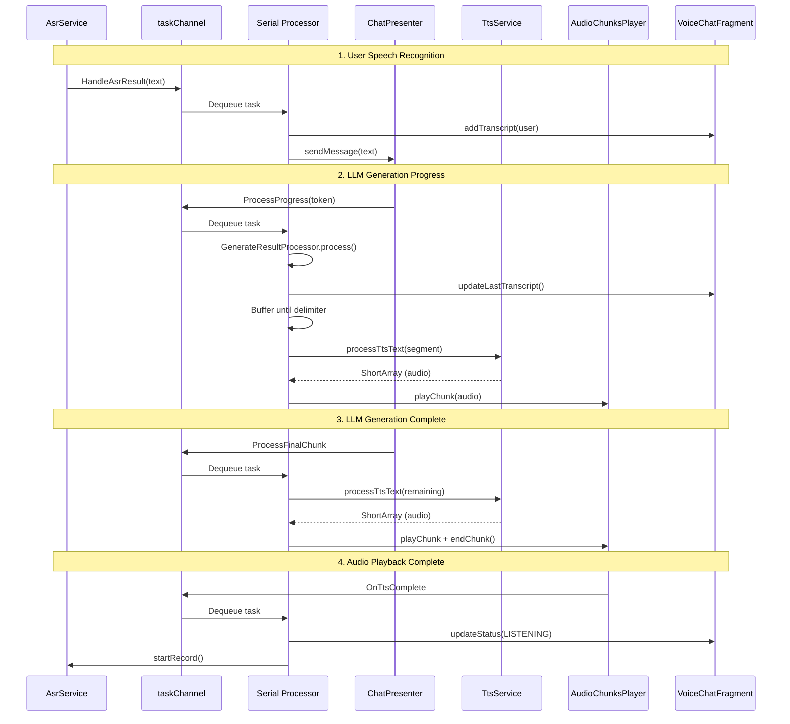
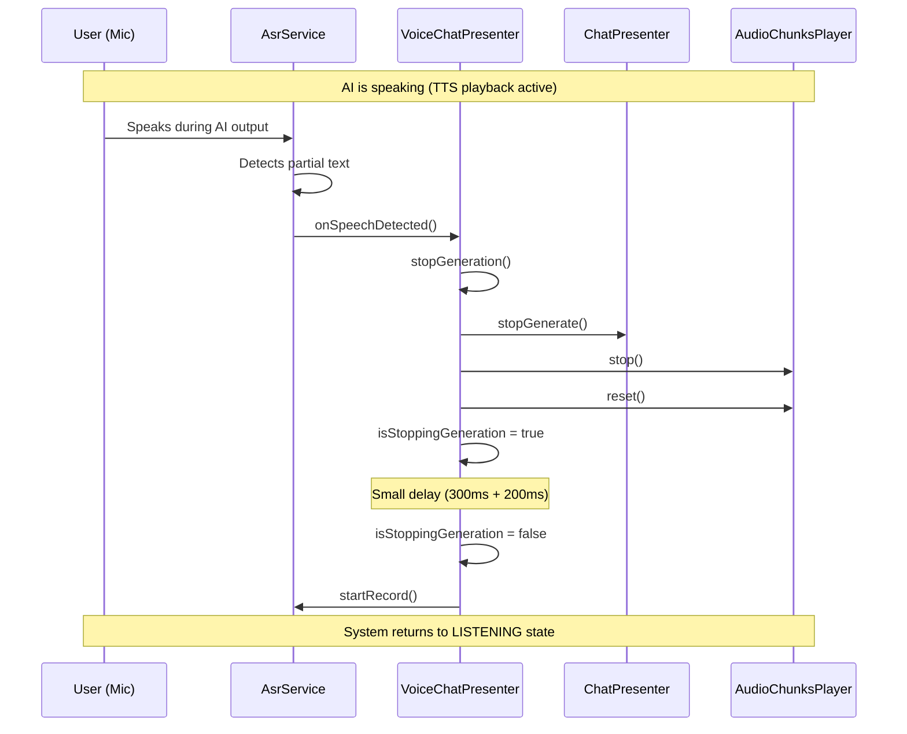
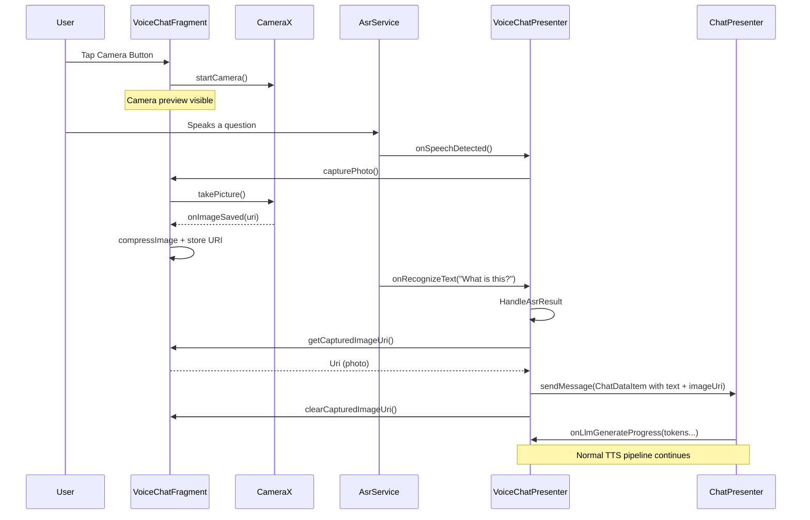
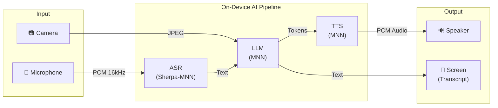
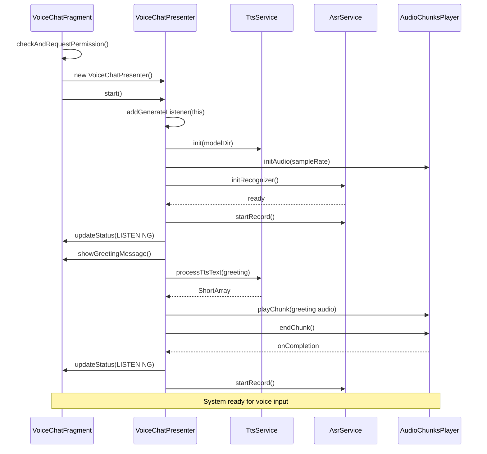
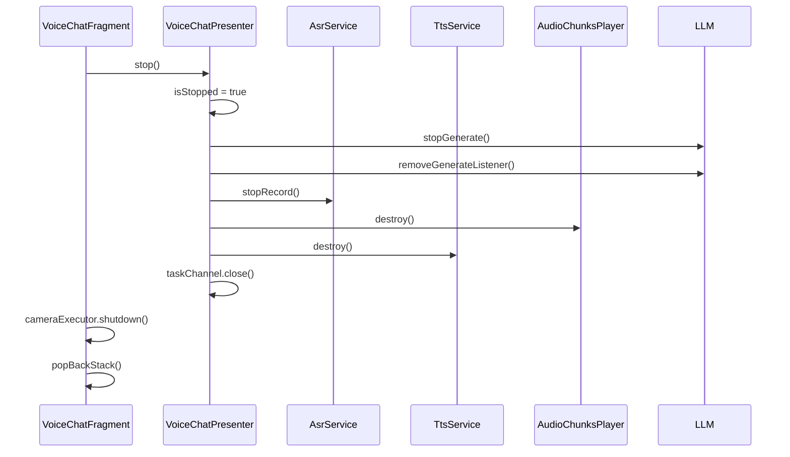

# VoiceChatFragment Technical Document

## 1. Overview

The Voice Chat feature in MNN LLM Chat provides a real-time, voice-driven conversational interface. Users can speak to the AI, which processes the speech via an on-device ASR (Automatic Speech Recognition) engine, sends the transcribed text to a local LLM (Large Language Model) for inference, and speaks the response back using an on-device TTS (Text-to-Speech) engine. It also supports **real-time vision** via CameraX and **voice interruption** (full-duplex).

All AI processing — ASR, LLM inference, and TTS — runs entirely on-device using MNN (Mobile Neural Network) native libraries.

---

## 2. Architecture

The module follows an **MVP (Model-View-Presenter)** pattern:

| Layer | Class | Responsibility |
| :--- | :--- | :--- |
| **View** | `VoiceChatFragment` | UI rendering, permissions, camera, user interactions |
| **Presenter** | `VoiceChatPresenter` | Orchestration of ASR, LLM, TTS; state management |
| **Model/Service** | `AsrService`, `TtsService`, `AudioChunksPlayer`, `ChatPresenter` | Core AI and audio playback engines |

### 2.1 Component Structure Diagram

---

## 3. Feature Details

### 3.1 Voice Chat (Core Loop)

The core voice chat loop follows a sequential pipeline:

**ASR → LLM → TTS → Audio Playback → ASR (repeat)**

#### State Machine

The presenter tracks its internal state via `VoiceChatPresenterState`:

The UI displays a simplified state via `VoiceChatState`:

#### Serial Task Processing

The presenter uses a **Kotlin Coroutine Channel** (`taskChannel`) to serialize all critical operations:

### 3.2 Voice Interruption (Full-Duplex)

Voice interruption allows the user to speak while the AI is still talking or generating, immediately canceling the current response.

**Key Design Decisions:**
- ASR recording stays **active** during LLM generation and TTS playback (the microphone is never stopped during a turn).
- `AsrService.onSpeechDetected` is triggered as soon as partial speech text is detected.
- When speech is detected during AI output, `stopGeneration()` is called immediately.

#### Echo Cancellation Modes

Two modes are supported to prevent the AI from hearing its own TTS output:

| Mode | Mechanism | Behavior |
| :--- | :--- | :--- |
| **Hardware AEC** (default) | `VOICE_COMMUNICATION` audio source + `AcousticEchoCanceler` | System-level echo cancellation; mic stays active |
| **Auto-Mute** (software) | `setMuted(true/false)` on `AsrService` | Mic is muted when AI speaks, unmuted when AI stops |

### 3.3 Real-Time Vision (Camera Integration)

Vision mode enables the AI to "see" the user's surroundings by capturing a photo from the camera and sending it alongside the voice transcription to a vision-capable LLM.

**Availability:** Only enabled when the current model supports vision (`ModelTypeUtils.isVisualModel(modelId)`).

**Camera Features:**
- Front/back camera switching via `switchCamera()`
- Images compressed in background via `cameraExecutor`
- CameraX lifecycle-aware, bound to `viewLifecycleOwner`

---

## 4. Key Classes Reference

### 4.1 VoiceChatFragment

| Responsibility | Details |
| :--- | :--- |
| UI Binding | `FragmentVoiceChatBinding` with status text, transcript list, control buttons |
| Permissions | `RECORD_AUDIO` for ASR, `CAMERA` for vision mode |
| Camera | CameraX with `Preview` + `ImageCapture` use cases |
| Transcript | `VoiceTranscriptAdapter` with smooth scroll |
| Model Settings | Opens `VoiceModelMarketBottomSheet` for TTS/ASR model switching |

### 4.2 VoiceChatPresenter

| Responsibility | Details |
| :--- | :--- |
| Serial Processing | `Channel<SerialTask>(UNLIMITED)` with `consumeEach` |
| ASR Management | `AsrService` init, start/stop recording, speech detection |
| LLM Integration | `ChatPresenter.GenerateListener` for progress callbacks |
| TTS Processing | Segments text at delimiters `[.,!。，！？?\n、：；:]`, calls `TtsService.process()` |
| Thinking Support | Uses `GenerateResultProcessor` to separate thinking vs. normal output |
| Greeting | Speaks a localized greeting on startup |
| Service Recreation | `recreateVoiceServices()` when user switches voice models |

### 4.3 AsrService

| Responsibility | Details |
| :--- | :--- |
| Engine | Sherpa-MNN `OnlineRecognizer` (streaming ASR) |
| Audio Source | `VOICE_COMMUNICATION` with AEC + Noise Suppressor |
| Sample Rate | 16000 Hz, mono, PCM 16-bit |
| Callbacks | `onRecognizeText` (endpoint), `onSpeechDetected` (partial) |
| Mute Support | `isMuted` flag fills buffer with zeros |

### 4.4 TtsService

| Responsibility | Details |
| :--- | :--- |
| Engine | MNN TTS native library (`mnn_tts`) |
| Init | Async via `Deferred`, supports `waitForInitComplete()` |
| Process | `process(text, id)` returns `ShortArray` (PCM audio) |
| Language | Configurable via `setLanguage()` |

### 4.5 AudioChunksPlayer

| Responsibility | Details |
| :--- | :--- |
| Engine | Android `AudioTrack` (streaming mode) |
| Chunk Playback | `playChunk(ShortArray)` writes PCM data |
| Completion | `endChunk()` sets a marker; invokes `onCompletionListener` when reached |
| Reset | Preserves listener reference across `reset()` calls |

---

## 5. Data Flow Diagram

---

## 6. Initialization Sequence

---

## 7. Shutdown & Cleanup

